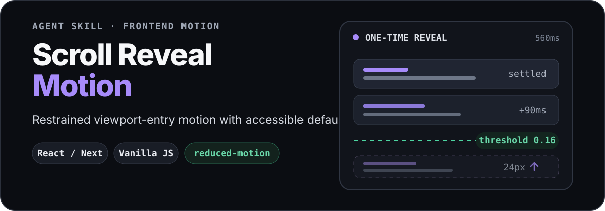

<p align="center">
  
</p>

<p align="center">
  English · <a href="README.zh-CN.md">简体中文</a>
</p>

<p align="center">
  <a href="https://github.com/zhoulinhua0-star/scroll-reveal-motion/actions/workflows/validate.yml"></a>
  <a href="LICENSE"></a>
</p>

Scroll Reveal Motion is an Agent Skill that helps coding agents add polished reveal-on-scroll motion to modern web interfaces. It reuses an animation dependency already present in the target project or falls back to the bundled React and Vanilla implementations—without hiding server-rendered content or ignoring motion preferences.

```text
below viewport  →  16% threshold  →  opacity + translateY  →  settled once
```

## Quick start

### 1. Install the Skill

Copy and paste this into Codex:

```text
Use $skill-installer to install the scroll-reveal-motion Skill from this
GitHub repository:
https://github.com/zhoulinhua0-star/scroll-reveal-motion

The Skill is located at skills/scroll-reveal-motion.
```

> **Syntax note:** `$` invokes a Skill in Codex; it is not a terminal prompt. ChatGPT uses `@`, while Claude Code uses `/`.

Start a new Codex task after installation so the refreshed Skill list is loaded. If it still does not appear, restart Codex.

### 2. Ask for the effect

```text
Use $scroll-reveal-motion to add restrained fade-up reveals to the
below-the-fold sections and feature cards on this landing page.
```

Natural language works too:

```text
Add an accessible staggered scroll reveal to these cards without adding
another animation dependency.
```

The Skill inspects the target frontend, chooses the smallest compatible implementation, applies motion where it improves hierarchy, and runs the project's own checks.

## How it chooses an implementation

| Target project | What the Skill does | Added animation dependency |
| --- | --- | --- |
| Motion, Framer Motion, GSAP, or another motion library | Reuses the existing library and matches the shared motion contract | None |
| React or Next.js | Adapts the semantic `ScrollReveal` component and shared CSS | None beyond React |
| Vanilla HTML/CSS/JavaScript | Adapts the `initScrollReveal()` controller and shared CSS | None |
| Another framework without a motion library | Adapts the Vanilla lifecycle to the framework | None |

Both bundled implementations use the same attributes, CSS variables, defaults, and one-time reveal behavior.

## What it changes—and what it protects

The Skill produces an adapted component or controller, integrated reveal styles, updated target markup, and a summary of validation results. Its guardrails keep the effect deliberately small:

- Content stays visible during server rendering, before initialization, and without JavaScript.
- `prefers-reduced-motion` is honored initially and if the preference changes while content is waiting.
- Only `opacity` and `transform` animate; there is no scroll-jacking or layout animation.
- DOM order, focus order, semantics, pointer behavior, and native layout remain intact.
- Observers disconnect after one-time reveals and during cleanup.

## Motion contract

- Reveal once at approximately `16%` viewport intersection with a small negative bottom root margin.
- Move from `translateY(20–24px)` to rest while fading from transparent to opaque.
- Use a `520–560ms` decelerating transition.
- Stagger up to four visually related children by `90ms`; later children share the fourth delay.
- Keep hero content and essential instructions immediately available.

<details>
<summary><strong>Stable attributes and CSS variables</strong></summary>

```text
data-scroll-reveal="single | stagger"
data-reveal-ready="true"
data-reveal-visible="true"

--reveal-delay
--reveal-distance
--reveal-duration
--reveal-stagger
--reveal-ease
```

Changing this surface requires updating both bundled implementations, the shared CSS, and validation together.

</details>

## What to provide

- The target frontend repository, page, or component.
- The sections or groups that should reveal—or permission for the Skill to select them.
- Any motion, browser, or dependency constraints.

## Repository layout

<details>
<summary><strong>View the installable package and repository tooling</strong></summary>

```text
scroll-reveal-motion/
├── skills/scroll-reveal-motion/   # Installable Skill package
│   ├── SKILL.md
│   ├── agents/openai.yaml
│   └── assets/
│       ├── scroll-reveal.css
│       ├── react/scroll-reveal.tsx
│       └── vanilla/scroll-reveal.js
├── scripts/validate-skill.mjs     # Dependency-free repository validator
├── tests/                         # Contract and controller tests
└── .github/workflows/validate.yml
```

Repository documentation and automation stay outside the installable Skill package, so agents load only the files needed for the task.

</details>

## Validate

The runtime templates add no animation dependency. Repository validation requires Node.js 20 or newer and downloads a pinned `esbuild` binary on the first run to parse the React/TypeScript asset.

```bash
npm test
npm run validate
```

Contributors with Codex installed can additionally run the official Skill validator:

```bash
python3 ~/.codex/skills/.system/skill-creator/scripts/quick_validate.py \
  skills/scroll-reveal-motion
```

## Contributing

Keep changes focused, accessible, and dependency-conscious. See [CONTRIBUTING.md](CONTRIBUTING.md) for validation and compatibility requirements.

## License

[MIT](LICENSE). This project implements a common scroll-reveal pattern and is not affiliated with or endorsed by any referenced product or website.
