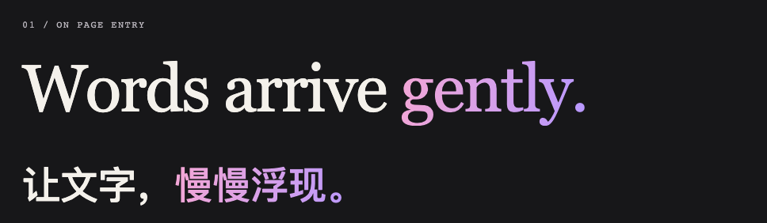

# Scroll Reveal Motion

Two Agent Skills for web motion: **headlines that fade in on page entry** and **sections that reveal as you scroll**.

English | [简体中文](README.zh-CN.md)

[](https://github.com/zhoulinhua0-star/scroll-reveal-motion/actions/workflows/validate.yml)
[](LICENSE)



*A completed frame from the [working example](examples/reveal-composition.html). Run it locally to see the entrance and the scroll-triggered cards.*

## Choose your motion

| Skill | Trigger and effect | Included today |
| --- | --- | --- |
| [`hero-text-reveal`](skills/hero-text-reveal/SKILL.md) | Page entry · staggered headline opacity | Implementation guidance, Phi reference notes, a Vanilla composition example |
| [`scroll-reveal-motion`](skills/scroll-reveal-motion/SKILL.md) | Viewport entry · one-time fade-up | React/Next.js component, Vanilla controller, shared CSS |

These are instructions and resources for a coding agent to adapt to your frontend. `hero-text-reveal` does **not** yet ship a reusable React component or a general-purpose text splitter. Its example uses text segmented at authoring time, including Chinese, emoji, and combining marks.

## Try the example

From this checkout's root:

```bash
python3 -m http.server 8765 --bind 127.0.0.1
```

Open [the local example](http://127.0.0.1:8765/examples/reveal-composition.html). Reload for the headline entrance, scroll to the cards, and enable your system's reduced-motion preference to compare the finished state. GitHub shows the HTML source; it does not run the example inline.

## Install

Install either skill alone or both. The local instructions below use the exact files in your checkout; marketplace installs use the version published upstream and may lag local changes.

### Codex — from this checkout

Copy the packages into your [personal skills directory](https://learn.chatgpt.com/docs/build-skills#where-codex-loads-local-skills):

```bash
mkdir -p ~/.agents/skills
cp -R skills/scroll-reveal-motion ~/.agents/skills/
cp -R skills/hero-text-reveal ~/.agents/skills/
```

Keep one installed copy of each skill name. If you already maintain these skills in a different supported location, update those copies instead of creating duplicates.

### Claude Code — from this checkout

Load the repository as a [local plugin](https://code.claude.com/docs/en/plugins#test-your-plugins-locally):

```bash
claude --plugin-dir .
```

Or copy either package into `~/.claude/skills/` for personal use. The repository contains one plugin named `scroll-reveal-motion`, with two skill directories.

<details>
<summary>Install the published Claude Code marketplace version</summary>

```text
/plugin marketplace add zhoulinhua0-star/scroll-reveal-motion
/plugin install scroll-reveal-motion@scroll-reveal-motion
```

Check that the installed revision contains `skills/hero-text-reveal` before invoking it. Use the local checkout instructions to try changes that have not been published.

</details>

## Use them together

After installing both, give your agent the target page and this prompt. In Codex:

```text
Use $hero-text-reveal for a staggered hero headline entrance, and
$scroll-reveal-motion for the below-the-fold sections and feature cards.
Preserve the existing typography, reuse existing animation dependencies,
and show the completed composition when reduced motion is enabled.
```

In Claude Code, with the plugin installed:

```text
Use /scroll-reveal-motion:hero-text-reveal for a staggered hero headline entrance,
and /scroll-reveal-motion:scroll-reveal-motion for the below-the-fold sections and
feature cards. Preserve the existing typography, reuse existing animation
dependencies, and show the completed composition when reduced motion is enabled.
```

| Installation | Hero invocation | Scroll invocation |
| --- | --- | --- |
| Codex | `$hero-text-reveal` | `$scroll-reveal-motion` |
| Claude Code personal skills | `/hero-text-reveal` | `/scroll-reveal-motion` |
| Claude Code plugin | `/scroll-reveal-motion:hero-text-reveal` | `/scroll-reveal-motion:scroll-reveal-motion` |

The skills inspect the target stack before adapting the effect. Provide the page or components, the text or groups to animate, and any timing or dependency constraints.

**One page, separate responsibilities:** keep the hero outside scroll-reveal wrappers. Each effect owns its own elements and timing; neither waits for the other. Use a shared reduced-motion policy and preserve existing motion conventions.

## Motion and compatibility

| | Hero text | Scroll sections |
| --- | --- | --- |
| Starting point | 1,000ms character fade, 80ms stagger, CSS `ease` | 20–24px rise, 520–560ms movement, 440–480ms fade |
| Properties | Opacity; optional later accent color transition | Opacity and transform |
| Sequence | Short headlines; tune longer text or use words/lines | About 16% intersection; 90ms stagger capped at four children |
| Dependencies | Guidance reuses project libraries or native browser animation | React only for the React template; none for Vanilla |

The hero timing comes from [inspected Phi Browser headline code](skills/hero-text-reveal/references/phi-entrance.md). The example derives its accent timing from its own text and uses a shorter color transition; it is an adaptation, not a pixel-perfect replica.

Both skills require readable fallback content, intact semantics, and a completed reduced-motion state. In the example, disabling JavaScript leaves the finite CSS headline entrance working and the scroll sections visible. Reduced motion shows everything immediately.

React/Next.js hero hydration, application routing, other fonts, and additional languages still need verification in the target project. The browser example covers a static Vanilla page, not those framework lifecycles.

<details>
<summary>Stable scroll integration contract</summary>

```text
data-scroll-reveal="single | stagger"
data-reveal-ready="true"
data-reveal-visible="true"

--reveal-delay
--reveal-distance
--reveal-duration
--reveal-fade-duration
--reveal-stagger
--reveal-ease
```

Keep the hero's attributes and variables in their own namespace. The hero guidance does not change this existing contract.

</details>

## Validation

Node.js 20+ is required for repository checks:

```bash
npm test
npm run validate
```

`npm test` runs eight existing scroll contract/controller tests. `npm run validate` also checks both skill packages, plugin manifests, Vanilla syntax, and React template compilation. The React check uses pinned `esbuild@0.25.9` and requires registry access or an available npm cache.

The optional browser suite checks the composition in Chromium and WebKit: stagger progression, complete heading names, grapheme integrity, stable layout, scroll coexistence, 360px width, initial/live reduced motion, and no-JavaScript behavior. These checks are separate from the default CI job.

With the example server running, install the browser test tooling and run:

```bash
npm install --no-save --package-lock=false playwright@1.62.1
npx playwright install chromium webkit
npm run check:browser
```

Results and screenshots are written to `.tmp/browser-check/`. The suite validates this example; it does not establish universal browser or framework compatibility.

## Repository layout

```text
skills/
├── hero-text-reveal/            # Guidance, UI metadata, reference notes
└── scroll-reveal-motion/        # Guidance, UI metadata, React/Vanilla/CSS assets
examples/reveal-composition.html # Bilingual working example
assets/readme/                  # Screenshot from the example
scripts/validate-skill.mjs       # Skill, contract and manifest checks
tests/                          # Default scroll tests + optional browser checks
.claude-plugin/                 # One plugin and its marketplace listing
.github/workflows/validate.yml  # Default repository validation
```

Documentation and browser examples stay outside the installable skill packages. Package and plugin metadata are at `1.1.0`, the release that added `hero-text-reveal`; the presence of further local changes does not imply a new published release.

## Contributing and license

See [CONTRIBUTING.md](CONTRIBUTING.md) for existing scroll-template requirements. Keep hero guidance focused and validate target-project behavior when adapting it.

[MIT](LICENSE). No affiliation with or endorsement by any reference website.
